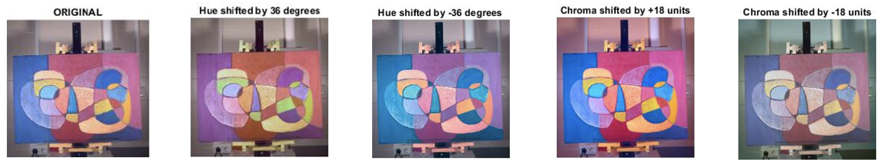

# Hyperspectral-Image-Segmentation 

## Objective

* Recovery RGB image from spectral cube and compute XYZ and CIELAB values.
* Segment the different regions of the painting according to colors using the spectral information captured with three hyperspectral/multispectral cameras.
* Determine which device gives best segmentation results.
* Design a psychophysical experiment to find thresholds when modifying the hue and chroma values of an image of a painting. 

## Segmentation 

### rendered color image from spectral image

Rendered images from first row to last row (each row with gamma correction 0.4,0.5,0.6):

Pikal 
* Hyperspectral linescanner type camera
* Wavelength range: 400 - 1000 nm
* Number of bands: 150

Specim IQ
* Hyperspectral linescanner type camera
* Wavelength range: 400 - 1000 nm
* Number of bands:204

SpectroCam 
* Multispectral filter wheel camera
* Wavelength range: 400 - 1000 nm
* Number of bands: 8

### K-Means clustering 

## Human Perception

### hue/chroma shift alternation

Alternation configuration:
* Increasing hue: Maximum of 10 Steps and offset size of +4 degrees per step.
* Decreasing hue: Maximum of 10 Steps and offset size of -4 degrees per step
* Increasing chroma: Maximum of 10 Steps and offset size of +2 units per step
* Decreasing chroma: Maximum of 10 Steps and offset size of -2 units per step

### psychophysical experiment 

Each pair of images will be shown 5 times.
The observer will have to complete 50 trials per block.
There are 4 blocks:
* Block for Increasing hue experiment
* Block for Decreasing hue experiment
* Block for Increasing chroma experiment
* Block for Decreasing chroma experiment 
Each observer will have to complete a total of 200 screens.

