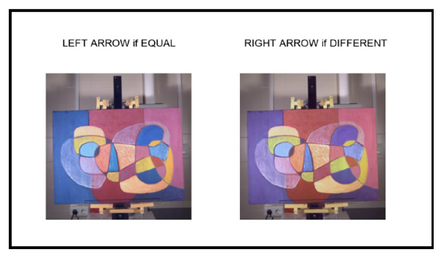

# Hyperspectral-Image-Segmentation 

## Objective

* Recovery RGB image from spectral cube and compute XYZ and CIELAB values.
* Segment the different regions of the painting according to colors using the spectral information captured with three hyperspectral/multispectral cameras.
* Determine which device gives best segmentation results.
* Design a psychophysical experiment to find thresholds when modifying the hue and chroma values of an image of a painting. 

## Segmentation 

### rendered color image from spectral image

### K-Means clustering 

## Human Perception

### hue/chroma shift alternation

### psychophysical experiment 

